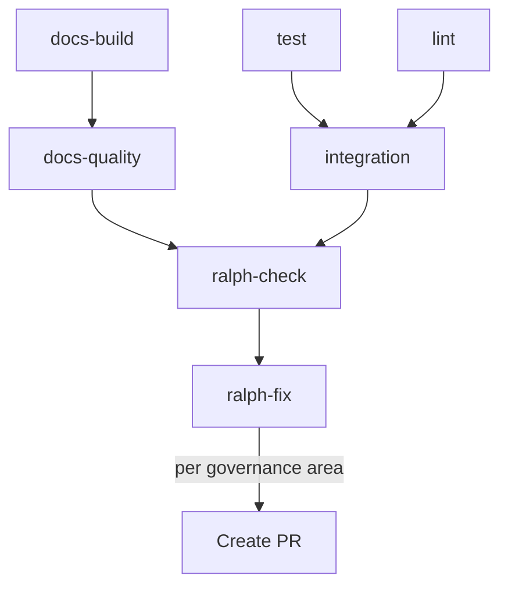

# CI Automation Governance

- Version: 1.0.0
- Last Updated: 2026-03-02
- Owner: Maintainer (`@devcomfort`)
- Scope: CI/CD 파이프라인 내 자동 검수 및 자동 개선 정책

## 1) Purpose & Scope

이 문서는 CI/CD 파이프라인 내에서의 **자동 검수·자동 개선** 정책을 정의한다.

목표:

- 모든 CI 검사의 도구, 인증, 트리거, 실패 처리가 명시적으로 문서화된다
- AI 기반 자동 개선(Ralph 루프)이 자율적으로 동작하되, 거버넌스 범위 내에서만 작동한다
- 비용과 리스크를 거버넌스 수준에서 통제할 수 있다

적용 범위:

- GitHub Actions 기반 자동 검사 워크플로우
- Ralph Wiggum 루프 기반 AI 자동 검수·개선
- 거버넌스 준수 자동 검증 (README, 구조, 버전, 문서 빌드)
- PR 노트 자동 생성 정책

비적용 범위:

- 빌드/테스트 CI (pytest, ruff 등) — 기존 `ci.yml`의 test/lint/integration job
- 배포 파이프라인 (Cloudflare Pages 등) — project-docs-governance에서 관리
- 문서 **내용** 정책 — project-docs-governance / readme-governance에서 관리
- 버전 **규칙** 자체 — versioning-governance에서 관리

## 2) Tool Policy

### 실행 엔진: Ralph Wiggum 루프

CI/CD 파이프라인은 **의사결정이 불가능한 환경**이다.
따라서 단순 Copilot CLI 호출(`copilot -p`)이 아닌, **Ralph 루프**를 사용하여 자율 판단하에 검사→진단→수정 사이클을 반복한다.

| 항목        | 정책                                                                     |
| ----------- | ------------------------------------------------------------------------ |
| 실행 엔진   | **Ralph Wiggum 루프** (자가수정 반복)                                    |
| AI 에이전트 | GitHub Copilot CLI (`--agent copilot`)                                   |
| 모델 선택   | 환경변수 `COPILOT_MODEL`로 지정 (GitHub Variables)                       |
| 반복 제한   | 환경변수 `RALPH_MAX_ITERATIONS`로 관리 — **0 이하 = 무한** (기본값 없음) |

#### 반복 제한 정책

- `RALPH_MAX_ITERATIONS` 환경변수로 제어한다
- 값이 **0 이하**이면 수렴할 때까지 무한 반복한다
- 값이 **양수**이면 해당 횟수만큼만 반복한다
- 기본값을 코드에 하드코딩하지 않는다 — 시스템 환경변수 또는 CI/CD 환경변수에서 반드시 명시적으로 설정
- 프로젝트마다 적절한 값이 다르므로, 이 거버넌스는 기본값을 **강제하지 않는다**

### 커스터마이제이션 안내

> **⚠️ 검사 항목이나 동작 방식을 변경하고 싶다면, 이 거버넌스 문서를 수정해야 합니다.**
>
> Ralph 루프와 CI 에이전트들은 이 문서(`.github/ci-governance.md`)를 실행 시점에 읽고,
> 여기에 정의된 정책만을 따릅니다. 검사 범위를 추가/축소하거나, 실패 처리 정책을
> 변경하려면 이 문서의 해당 섹션을 수정하고 PR을 통해 반영하세요.
>
> - 검사 항목 변경 → [Section 7: Check Scope](#7-check-scope) 수정
> - 실패 처리 변경 → [Section 5: Failure & Reporting Policy](#5-failure--reporting-policy) 수정
> - 브랜치/PR 전략 변경 → [Section 8: Ralph Branch & PR Strategy](#8-ralph-branch--pr-strategy) 수정

## 3) Authentication Policy

| 항목                | 규칙                                                         |
| ------------------- | ------------------------------------------------------------ |
| PAT 종류            | Fine-grained PAT with **Copilot Requests** 권한              |
| GitHub Secrets 이름 | `PERSONAL_ACCESS_TOKEN`                                      |
| 워크플로우 환경변수 | `COPILOT_GITHUB_TOKEN: ${{ secrets.PERSONAL_ACCESS_TOKEN }}` |
| 모델 설정           | GitHub Variables: `COPILOT_MODEL`                            |
| Ralph 반복 제한     | GitHub Variables: `RALPH_MAX_ITERATIONS`                     |

시크릿/변수 네이밍 컨벤션:

- 시크릿: `SCREAMING_SNAKE_CASE`, 접두어 없이 용도를 명확히 (예: `PERSONAL_ACCESS_TOKEN`)
- 변수: `SCREAMING_SNAKE_CASE`, 도구 접두어 사용 (예: `COPILOT_MODEL`, `RALPH_MAX_ITERATIONS`)

## 4) Trigger Policy

**Event-driven 전용** — 스케줄(cron) 검사는 사용하지 않는다.

| 트리거 | 조건                   | 동작                              |
| ------ | ---------------------- | --------------------------------- |
| PR     | `pull_request` to main | 전체 검사 수행 (blocking)         |
| Push   | `push` to main         | merge commit 제외, 전체 검사 수행 |
| Manual | `workflow_dispatch`    | 디버깅 및 수동 트리거             |

**중복 검증 방지**:
PR 머지로 인한 push는 자동으로 스킵한다:

```yaml
if: >
  github.event_name == 'pull_request' ||
  (github.event_name == 'push' &&
   !startsWith(github.event.head_commit.message, 'Merge pull request'))
```

## 5) Failure & Reporting Policy

| 항목         | 정책                                                              |
| ------------ | ----------------------------------------------------------------- |
| 실패 시 동작 | **Blocking** — 검사 실패 시 머지 차단                             |
| 리포트 형식  | Workflow log 출력 + `specs_ci/ci-check-report.md` (Ralph 모드)    |
| 후속 조치    | Ralph 파이프라인이 개선 제안 PR 자동 생성 (아래 브랜치 전략 참조) |
| 에스컬레이션 | Ralph가 수렴하지 못하면 리포트를 남기고 실패 상태로 종료          |

### 실패 유형별 처리

| 유형               | 처리                                                     |
| ------------------ | -------------------------------------------------------- |
| lint/test 실패     | 즉시 blocking — 기존 ci.yml test/lint job                |
| 구조/거버넌스 위반 | Ralph 루프가 자동 수정 시도 → 실패 시 리포트 + blocking  |
| 문서 빌드 실패     | `zensical build` 실패 → blocking                         |
| docs 품질 게이트   | markdownlint/cspell/lychee 실패 → 리포트 후 Ralph가 개선 |

## 6) Cost Control Policy

| 항목              | 규칙                                                              |
| ----------------- | ----------------------------------------------------------------- |
| Copilot 과금 모델 | 요청 횟수 기반                                                    |
| Ralph 반복 상한   | `RALPH_MAX_ITERATIONS` 환경변수 — 0 이하 = 무한, 양수 = 해당 횟수 |
| 모델 등급         | 경제적 모델 우선, 거버넌스 수정으로 업그레이드                    |
| 실행 빈도         | event-driven (PR + main push) — 불필요한 반복 트리거 없음         |

비용 통제 원칙:

- 스케줄 실행을 하지 않아 불필요한 요청을 방지한다
- 모델 변경은 `COPILOT_MODEL` 변수를 통해 즉시 전환 가능하다
- Ralph 반복 횟수는 프로젝트 담당자가 CI 비용을 보고 조정한다

## 7) Check Scope

CI에서 수행하는 검사 항목. 항목을 추가·제거하려면 이 섹션을 수정하세요.

### 기존 CI 검사 (ci.yml — 변경 없음)

| Job           | 검사 내용                      | Blocking |
| ------------- | ------------------------------ | -------- |
| `test`        | pytest (Python 3.10~3.13, tox) | ✅ Yes   |
| `lint`        | ruff check src/ tests/         | ✅ Yes   |
| `integration` | Docker 기반 E2E 통합 테스트    | ✅ Yes   |

### AI 자동 검수 (Ralph 루프 — 신규)

| 카테고리      | 검사 항목                                                | 거버넌스 근거            |
| ------------- | -------------------------------------------------------- | ------------------------ |
| README 준수   | 필수 섹션 존재, manifest 데이터 일치, 예시 유효성        | readme-governance.md     |
| 프로젝트 구조 | .help 에이전트, manifest 유효성, 네이밍, agent-prompt 쌍 | (구조 규칙)              |
| 버전 일관성   | manifest ↔ registry ↔ README, SemVer 유효성              | versioning-governance.md |

### 문서 사이트 검사 (신규)

| 검사             | 도구             | Blocking |
| ---------------- | ---------------- | -------- |
| 문서 빌드        | `zensical build` | ✅ Yes   |
| Markdown 린팅    | markdownlint     | ✅ Yes   |
| 스펠체크         | cspell           | ✅ Yes   |
| 깨진 링크        | lychee           | ✅ Yes   |
| 코드 블록 정확성 | doctest-style    | ✅ Yes   |

> **커스터마이제이션**: 검사 항목을 변경하려면 위 표를 수정하세요.
> Ralph 루프는 이 섹션을 파싱하여 검사 범위를 결정합니다.

## 8) Ralph Branch & PR Strategy

Ralph 루프가 자동 개선을 수행할 때, **거버넌스 영역별로 별도 브랜치에서 작업하고 각각 PR을 생성**한다.

### 브랜치 네이밍 컨벤션

```
ci/ralph/{governance-area}/{short-description}
```

| 거버넌스 영역 | 브랜치 예시                                     |
| ------------- | ----------------------------------------------- |
| README 준수   | `ci/ralph/readme/fix-kit-table-count`           |
| 프로젝트 구조 | `ci/ralph/structure/add-missing-help-agent`     |
| 버전 일관성   | `ci/ralph/versioning/sync-manifest-registry`    |
| 문서 사이트   | `ci/ralph/docs/fix-broken-links`                |
| docs 품질     | `ci/ralph/docs-quality/fix-markdownlint-errors` |

### 브랜치 분리 규칙

1. **하나의 거버넌스 영역 = 하나의 브랜치 + 하나의 PR**
2. 동일 영역 내 여러 수정은 하나의 PR에 묶는다
3. 서로 다른 영역의 수정은 반드시 분리한다
4. 기존에 열린 PR이 있으면 해당 브랜치에 추가 커밋한다 (중복 PR 방지)

### PR 자동 생성

Ralph가 개선을 수행하면 자동으로 PR을 생성한다. 생성 조건:

- 수정 사항이 1건 이상 존재할 때
- 대상 브랜치에 아직 열린 PR이 없을 때 (있으면 기존 PR에 추가)

## 9) PR Note Policy

Ralph가 생성하는 PR과 개발자가 작성하는 PR 모두에 적용되는 노트 정책.

### PR Note 필수 구조

```markdown
## 📋 Summary

{1~2문장으로 이 PR이 해결하는 문제 요약}

## 🔍 Problem Description

{왜 이 변경이 필요한가 — 근거 거버넌스, 위반 내용, 에러 메시지 등}

### Governance Reference

- 근거 문서: {`.github/xxx-governance.md` Section N}
- 위반 유형: {구체적 위반 내용}

## 🔧 Patch Details

{무엇을 변경했는가 — 파일별 변경 내용}

### Changed Files

| File   | Change Type         | Description |
| ------ | ------------------- | ----------- |
| {path} | {add/modify/delete} | {설명}      |

## ✅ Verification

{변경 후 검증 방법 — 어떤 명령/테스트로 확인했는가}

## 📝 Notes for Reviewers

{리뷰어가 특별히 주의해야 할 사항, 관련 컨텍스트}
```

### Ralph 자동 PR Note 규칙

Ralph가 PR을 생성할 때 추가로 포함해야 하는 정보:

| 항목            | 내용                                                |
| --------------- | --------------------------------------------------- |
| 트리거 원인     | 어떤 CI 검사에서 실패가 감지되었는가                |
| Ralph 반복 횟수 | 수렴까지 몇 회 반복했는가                           |
| 수렴 여부       | 완전 수렴 / 부분 수렴 (남은 이슈 목록)              |
| 거버넌스 버전   | 참조한 거버넌스 문서의 버전                         |
| 자동화 레이블   | `ci/ralph-auto`, `governance/{area}` 라벨 자동 부착 |

### 개발자 PR Note 규칙

- 위 필수 구조를 따르되, Ralph 전용 항목(반복 횟수, 수렴 여부)은 생략 가능
- 거버넌스 영역에 해당하는 변경을 포함하면 **Governance Reference** 섹션 필수
- 순수 코드 변경(거버넌스 무관)이면 Governance Reference 생략 가능

### PR Labels

| Label                     | 용도                            | 부착 주체      |
| ------------------------- | ------------------------------- | -------------- |
| `ci/ralph-auto`           | Ralph 자동 생성 PR 식별         | Ralph          |
| `governance/readme`       | README 거버넌스 관련 변경       | Ralph / 개발자 |
| `governance/versioning`   | 버전 거버넌스 관련 변경         | Ralph / 개발자 |
| `governance/structure`    | 구조 규칙 관련 변경             | Ralph / 개발자 |
| `governance/docs`         | 문서 사이트 관련 변경           | Ralph / 개발자 |
| `governance/docs-quality` | 문서 품질(lint/spell/link) 관련 | Ralph / 개발자 |

## 10) Workflow Architecture

### Job Dependency Graph



### Job 설명

| Job            | 설명                                                    | Blocking               |
| -------------- | ------------------------------------------------------- | ---------------------- |
| `test`         | pytest (기존)                                           | ✅                     |
| `lint`         | ruff (기존)                                             | ✅                     |
| `integration`  | Docker E2E (기존)                                       | ✅                     |
| `docs-build`   | `zensical build` 성공 확인                              | ✅                     |
| `docs-quality` | markdownlint + cspell + lychee + doctest                | ✅                     |
| `ralph-check`  | Ralph 루프: 거버넌스 준수 검사 (README, 구조, 버전)     | ✅                     |
| `ralph-fix`    | 검사 실패 시 자동 수정 + 거버넌스 영역별 브랜치/PR 생성 | ⚠️ Non-blocking (제안) |

> `ralph-fix`는 실패해도 전체 워크플로우를 차단하지 않는다.
> 수정 **제안**이 목적이므로, PR이 생성되면 개발자가 리뷰·머지한다.

## 11) Exception Handling

| 상황                            | 처리                                                           |
| ------------------------------- | -------------------------------------------------------------- |
| Ralph가 수렴하지 못함           | 리포트를 남기고 실패 상태로 종료, PR에 `needs-manual-fix` 라벨 |
| 거버넌스 문서가 없음            | `cikit.ci.governance` 실행 안내 메시지 출력 후 skip            |
| 시크릿/변수 미설정              | 명확한 에러 메시지 + `cikit.ci.doctor` 안내                    |
| Zensical/cyclopts 업스트림 장애 | docs-build/docs-quality job만 실패, 다른 검사 영향 없음        |

## 12) Governance Self-Versioning

| Bump  | Trigger                                                |
| ----- | ------------------------------------------------------ |
| MAJOR | 호환 불가 정책 변경 (예: blocking → non-blocking 전환) |
| MINOR | 새 검사 항목 추가, 새 정책 영역 추가                   |
| PATCH | 문구 수정, 예시 추가, 라벨명 변경                      |

## Amendment Log

| Version | Date       | Change                                                                                                                |
| ------- | ---------- | --------------------------------------------------------------------------------------------------------------------- |
| 1.0.0   | 2026-03-02 | 초기 거버넌스 수립 — Ralph 루프, blocking 정책, 브랜치 분리 전략, PR 노트 정책, docs 품질 게이트, 워크플로우 아키텍처 |
